# Compiler Theory App

**Compiler Theory App** - это приложение для редактирования и анализа кода. Оно предоставляет удобный текстовый редактор с расширенными возможностями, также включает функции анализа кода с поддержкой автодополнения и вывода ошибок компиляции.

**Язык программирования:** C#, WPF.

## Оглавление

- [Лабораторная работа №1: Разработка пользовательского интерфейса (GUI) для языкового процессора](#лабораторная-работа-1-разработка-пользовательского-интерфейса-gui-для-языкового-процессора)
- [Лабораторная работа №2: Разработка лексического анализатора (сканера)](#лабораторная-работа-2-разработка-лексического-анализатора-сканера)

## Лабораторная работа №1: Разработка пользовательского интерфейса (GUI) для языкового процессора

**Тема:** Создание текстового редактора с возможностью последующего расширения в направлении языкового процессора.

**Цель работы:** Разработка графического приложения с интерфейсом пользователя для редактирования текстовых данных. Приложение предполагается использовать как основу для будущего расширения функционала в направлении языкового процессора.

### Текстовый Редактор

- **Меню**
- | Пункт меню | Подпункты                                                    |
  | ------ |--------------------------------------------------------------|
  | Файл | 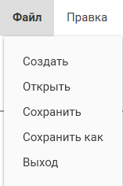     |
  | Правка | 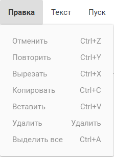  |
  | Текст | 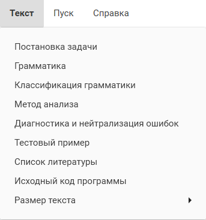   |
  | Справка | 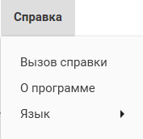 |

- **Базовые Операции:**
    - Открытие, создание и сохранение файлов.
    - Поддержка множества вкладок для одновременного редактирования различных файлов.

      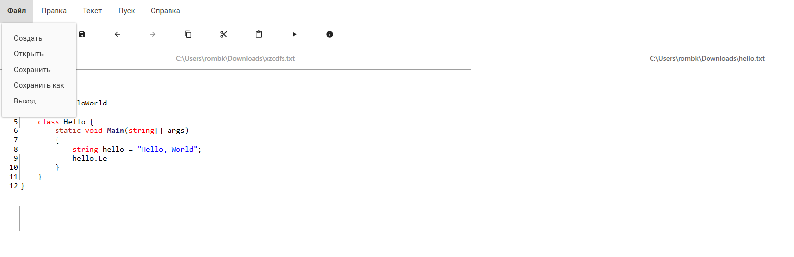

- **Редактирование Кода:**
    - Подсветка синтаксиса и автодополнение для улучшенной читаемости кода.
    - Возможность отмены (Undo) и повтора (Redo) действий.
    - Операции копирования, вставки, удаления и выделения текста.
  
      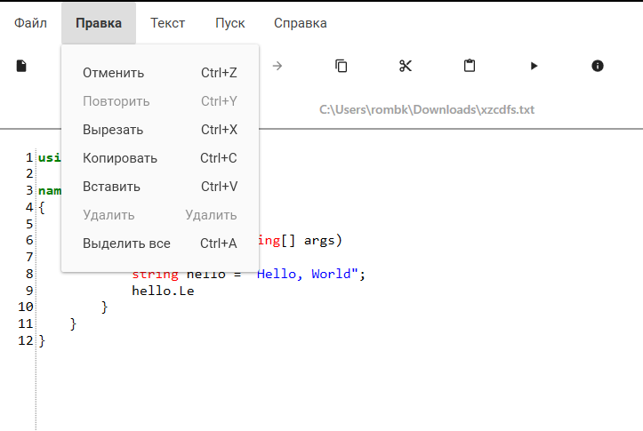

- **Настройки Внешнего Вида:**
    - Изменение размера шрифта для удобства чтения.
  
      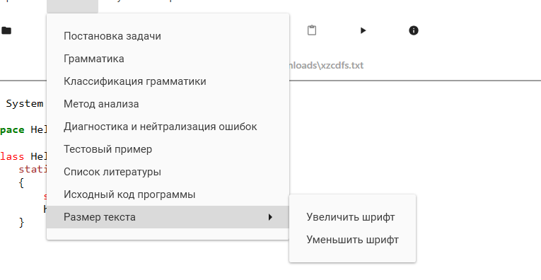

### Анализ Кода

- **Подсветка Ошибок Компиляции:**
    - Вывод ошибок компиляции в удобном формате.

      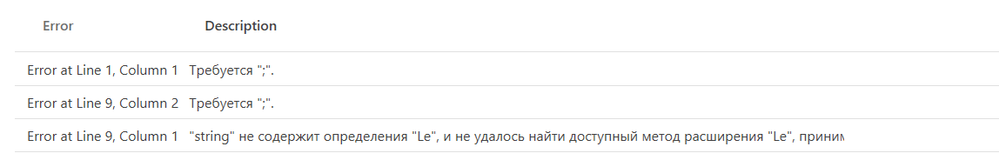
      
- **Автодополнение:**
    - Подсказки по автодополнению при вводе кода.

      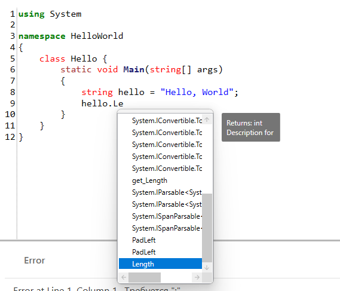
      
- **Семантический Анализ:**
    - Анализ кода на основе компилятора C# для определения типов и доступных членов.
    - 
      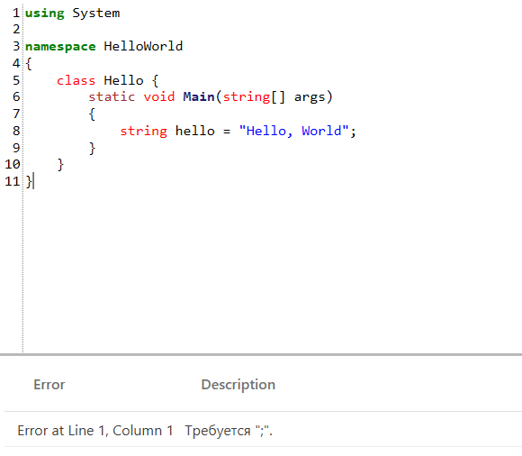

### Другие Функции

- **Создание и Открытие Примеров Кода:**
    - Возможность загрузки примеров кода для изучения и экспериментов.

          

- **Поддержка Многозадачности:**
    - Возможность одновременного редактирования и анализа нескольких файлов.
  
      


## Лабораторная работа №2: Разработка лексического анализатора (сканера)

**Тема:** разработка лексического анализатора (сканера).

**Цель работы:** изучить назначение лексического анализатора. Спроектировать алгоритм и выполнить программную реализацию сканера.

| №  | Тема | Пример верной строки | Справка |
|----| ------ | ------ | ------ |
| 17 | Объявление ассоциативного массива языка Java | Map<String, String> map = new HashMap<String, String>(); | [ссылка](https://www.geeksforgeeks.org/implementing-associate-array-in-java/) |

**В соответствии с вариантом задания необходимо:**

1. Спроектировать диаграмму состояний сканера.
2. Разработать лексический анализатор, позволяющий выделить в тексте лексемы, иные символы считать недопустимыми (выводить ошибку).
3. Встроить сканер в ранее разработанный интерфейс текстового редактора. Учесть, что текст для разбора может состоять из множества строк.

**Входные данные:** строка (текст программного кода).

**Выходные данные:** последовательность условных кодов, описывающих структуру разбираемого текста с указанием места положения и типа.

### Примеры допустимых строк

```
Map<String, String> map = new HashMap<String, String>();
```

```
Map<string, string> map = new HashMap<string, string>();
```

```
Map<float, float> _12map = new HashMap<float, float>();
```

```
Map<int, string> _map = new HashMap<int, string>();
```

### Диаграмма состояний сканера

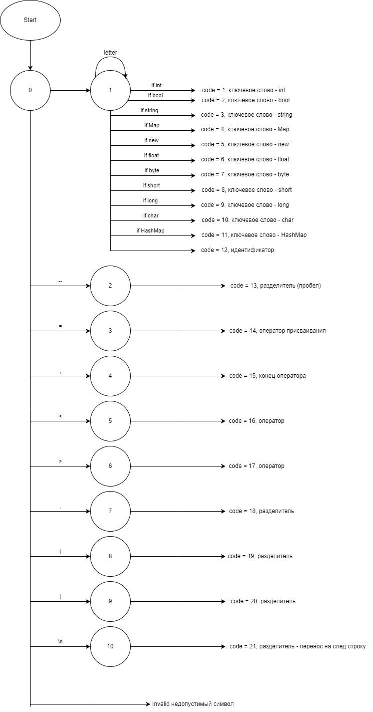

### Тестовые примеры

1. **Тест №1.** Пример, показывающий все возможные лексемы, которые могут быть найдены лексическим анализатором.
   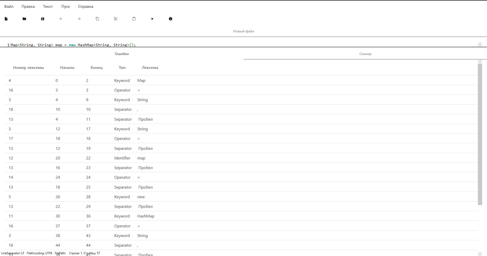

2. **Тест №2.** Сложный пример.
   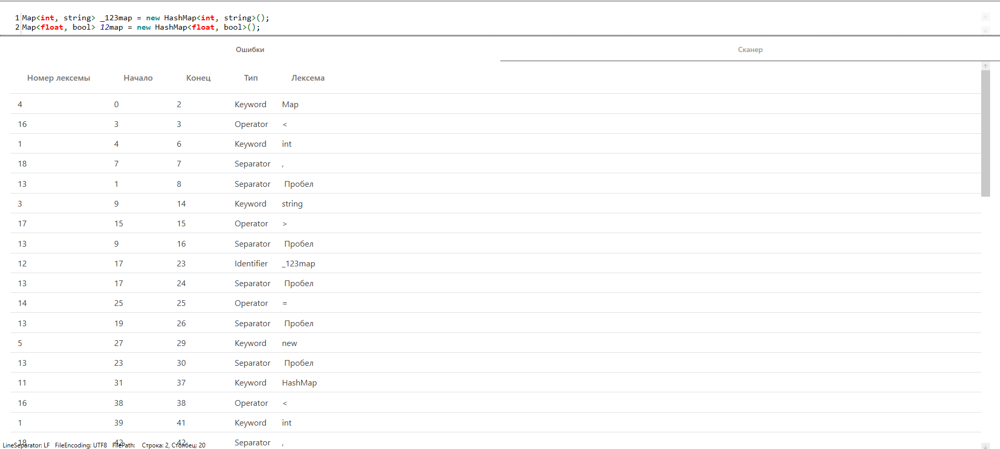

3. **Тест №3.** Сложный пример.
   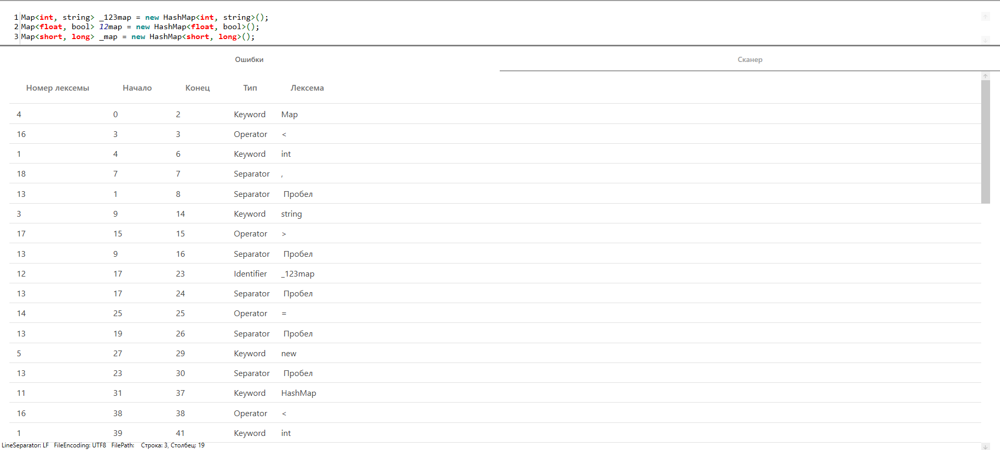

## Используемые Библиотеки

- [AvalonEdit](https://www.nuget.org/packages/AvalonEdit/) (версия 6.3.0.90)
- [Material.Icons](https://www.nuget.org/packages/Material.Icons/) (версия 2.1.6)
- [Material.Icons.WPF](https://www.nuget.org/packages/Material.Icons.WPF/) (версия 2.1.0)
- [MaterialDesignExtensions](https://www.nuget.org/packages/MaterialDesignExtensions/) (версия 4.0.0-a02)
- [MaterialDesignThemes](https://www.nuget.org/packages/MaterialDesignThemes/) (версия 4.9.0)
- [MaterialDesignColors](https://www.nuget.org/packages/MaterialDesignColors/) (версия 2.1.4)
- [MaterialDesignThemes.MahApps](https://www.nuget.org/packages/MaterialDesignThemes.MahApps/) (версия 0.3.0)
- [Microsoft.CodeAnalysis.CSharp](https://www.nuget.org/packages/Microsoft.CodeAnalysis.CSharp/) (версия 4.9.0-3.final)
- [Microsoft.CodeAnalysis.CSharp.Scripting](https://www.nuget.org/packages/Microsoft.CodeAnalysis.CSharp.Scripting/) (версия 4.9.0-3.final)
- [Microsoft.CodeAnalysis.CSharp.Workspaces](https://www.nuget.org/packages/Microsoft.CodeAnalysis.CSharp.Workspaces/) (версия 4.9.0-3.final)
- [Microsoft.Xaml.Behaviors.Wpf](https://www.nuget.org/packages/Microsoft.Xaml.Behaviors.Wpf/) (версия 1.1.77)
- [Prism.Wpf](https://www.nuget.org/packages/Prism.Wpf/) (версия 9.0.271-pre)

*Примечание: Убедитесь, что все пакеты устанавливаются из указанных версий для обеспечения совместимости.*

---

*Разработано с использованием технологий .NET и популярных библиотек для создания удобного и эффективного инструмента для работы с кодом на языке C#.*