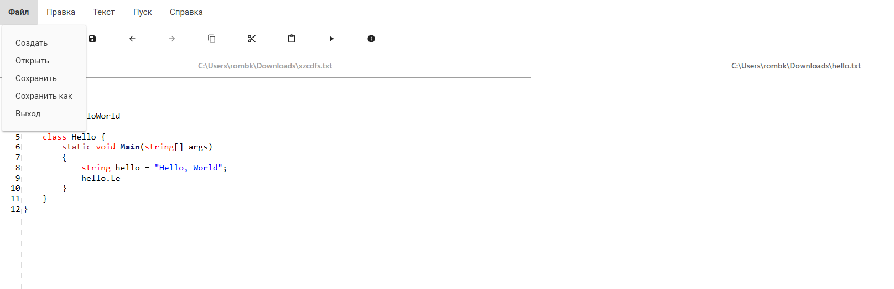
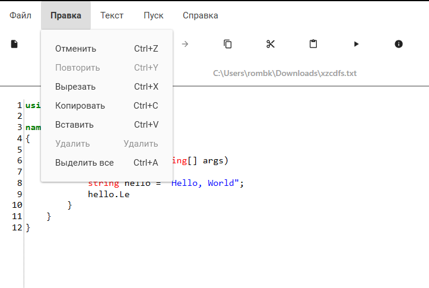
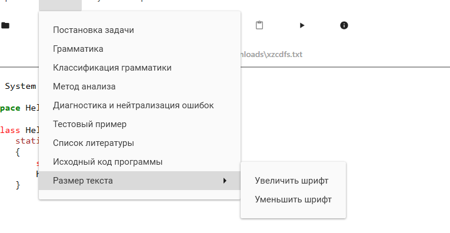
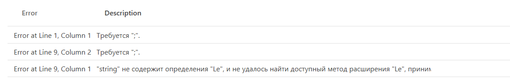
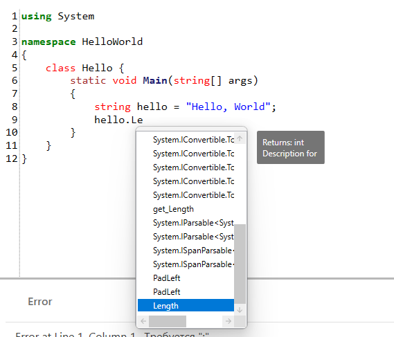
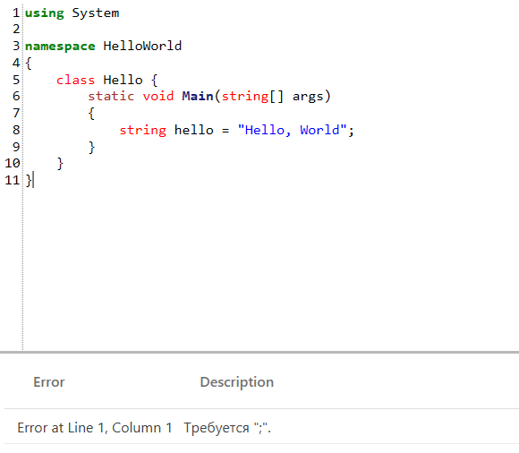
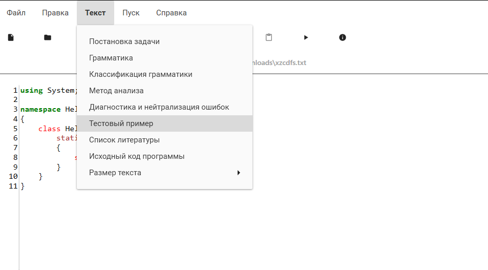
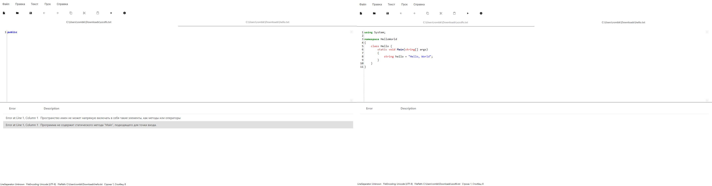

# Compiler Theory App

**Compiler Theory App** - это приложение для редактирования и анализа кода на языке C#. Он предоставляет удобный текстовый редактор с расширенными возможностями, также включает функции анализа кода с поддержкой автодополнения и вывода ошибок компиляции.

## Возможности

### Текстовый Редактор

- **Базовые Операции:**
    - Открытие, создание и сохранение файлов.
    - Поддержка множества вкладок для одновременного редактирования различных файлов.

      

- **Редактирование Кода:**
    - Подсветка синтаксиса и автодополнение для улучшенной читаемости кода.
    - Возможность отмены (Undo) и повтора (Redo) действий.
    - Операции копирования, вставки, удаления и выделения текста.
  
      

- **Настройки Внешнего Вида:**
    - Изменение размера шрифта для удобства чтения.
  
      

### Анализ Кода

- **Подсветка Ошибок Компиляции:**
    - Вывод ошибок компиляции в удобном формате.

      
      
- **Автодополнение:**
    - Подсказки по автодополнению при вводе кода.

      
      
- **Семантический Анализ:**
    - Анализ кода на основе компилятора C# для определения типов и доступных членов.
    - 
      

### Другие Функции

- **Создание и Открытие Примеров Кода:**
    - Возможность загрузки примеров кода для изучения и экспериментов.

          

- **Поддержка Многозадачности:**
    - Возможность одновременного редактирования и анализа нескольких файлов.
  
      

## Используемые Библиотеки

- [AvalonEdit](https://www.nuget.org/packages/AvalonEdit/) (версия 6.3.0.90)
- [Material.Icons](https://www.nuget.org/packages/Material.Icons/) (версия 2.1.6)
- [Material.Icons.WPF](https://www.nuget.org/packages/Material.Icons.WPF/) (версия 2.1.0)
- [MaterialDesignExtensions](https://www.nuget.org/packages/MaterialDesignExtensions/) (версия 4.0.0-a02)
- [MaterialDesignThemes](https://www.nuget.org/packages/MaterialDesignThemes/) (версия 4.9.0)
- [MaterialDesignColors](https://www.nuget.org/packages/MaterialDesignColors/) (версия 2.1.4)
- [MaterialDesignThemes.MahApps](https://www.nuget.org/packages/MaterialDesignThemes.MahApps/) (версия 0.3.0)
- [Microsoft.CodeAnalysis.CSharp](https://www.nuget.org/packages/Microsoft.CodeAnalysis.CSharp/) (версия 4.9.0-3.final)
- [Microsoft.CodeAnalysis.CSharp.Scripting](https://www.nuget.org/packages/Microsoft.CodeAnalysis.CSharp.Scripting/) (версия 4.9.0-3.final)
- [Microsoft.CodeAnalysis.CSharp.Workspaces](https://www.nuget.org/packages/Microsoft.CodeAnalysis.CSharp.Workspaces/) (версия 4.9.0-3.final)
- [Microsoft.Xaml.Behaviors.Wpf](https://www.nuget.org/packages/Microsoft.Xaml.Behaviors.Wpf/) (версия 1.1.77)
- [Prism.Wpf](https://www.nuget.org/packages/Prism.Wpf/) (версия 9.0.271-pre)

*Примечание: Убедитесь, что все пакеты устанавливаются из указанных версий для обеспечения совместимости.*

---

*Разработано с использованием технологий .NET и популярных библиотек для создания удобного и эффективного инструмента для работы с кодом на языке C#.*